# MS Individual Project : music-oriented human motion generation with GANs

The dataset comes from [Music-to-Dance-Motion-synthesis](https://github.com/Music-to-dance-motion-synthesis/dataset). It is composed of 3D motion capture of choreographies along with audio track (~90min). There are four types of dance, waltz, cha-cha, tango & rumba.

:grey_exclamation: The dataset is corrupted. Waltz sequences are 4 times slower and need to be interpolated. Plus, audio and stick sequences are not synchronized. To be continued.

| Mean 2D stick figure across dataset | Mean 3D stick figure across dataset |
|:-------------------------:|:-------------------------:|
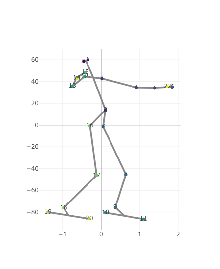 | 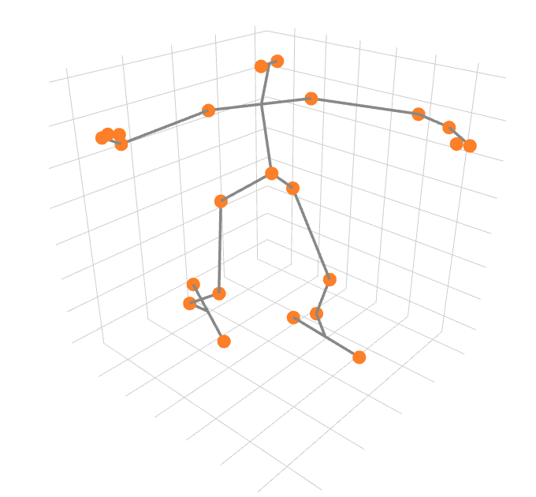 |

## Implementation of WGANs to generate stick figures

| | | | |
|:-------------------------:|:-------------------------:|:-------------------------:|:-------------------------:|
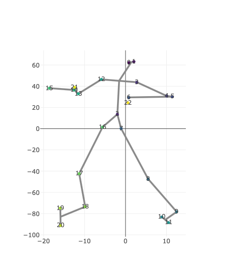  | 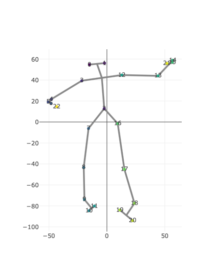  |  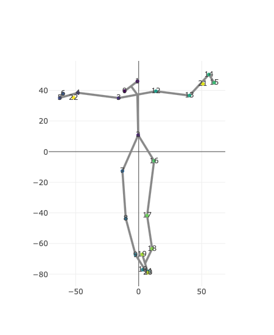 | 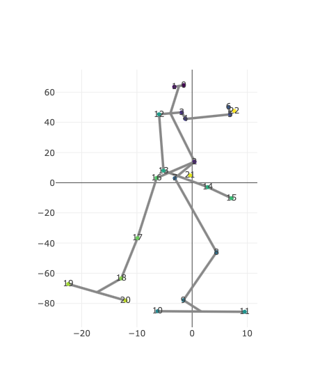 |
  | 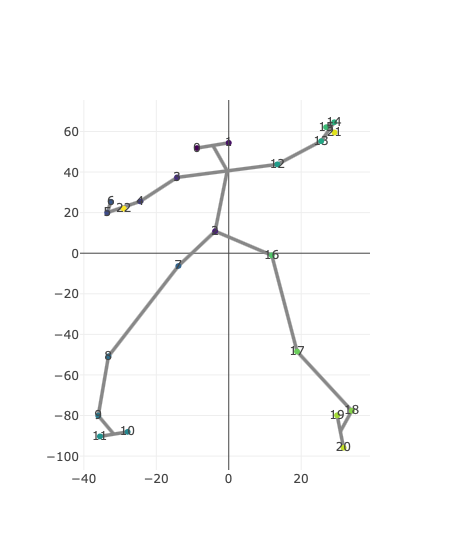  |  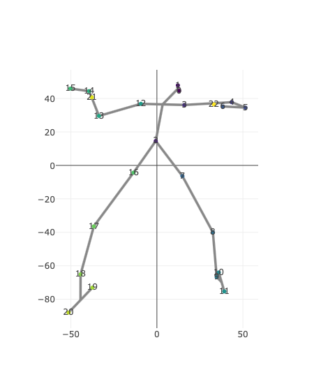 | 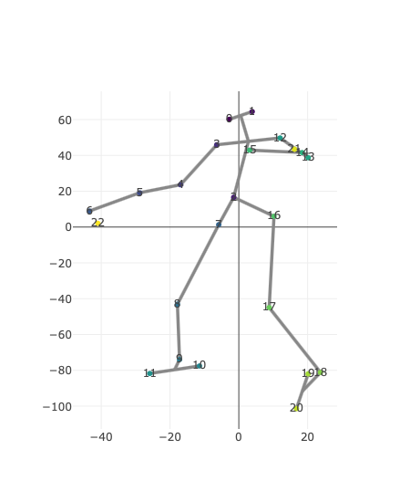 |

Here a residual fully-connected network is used to generate those samples. The architecture is as follows :

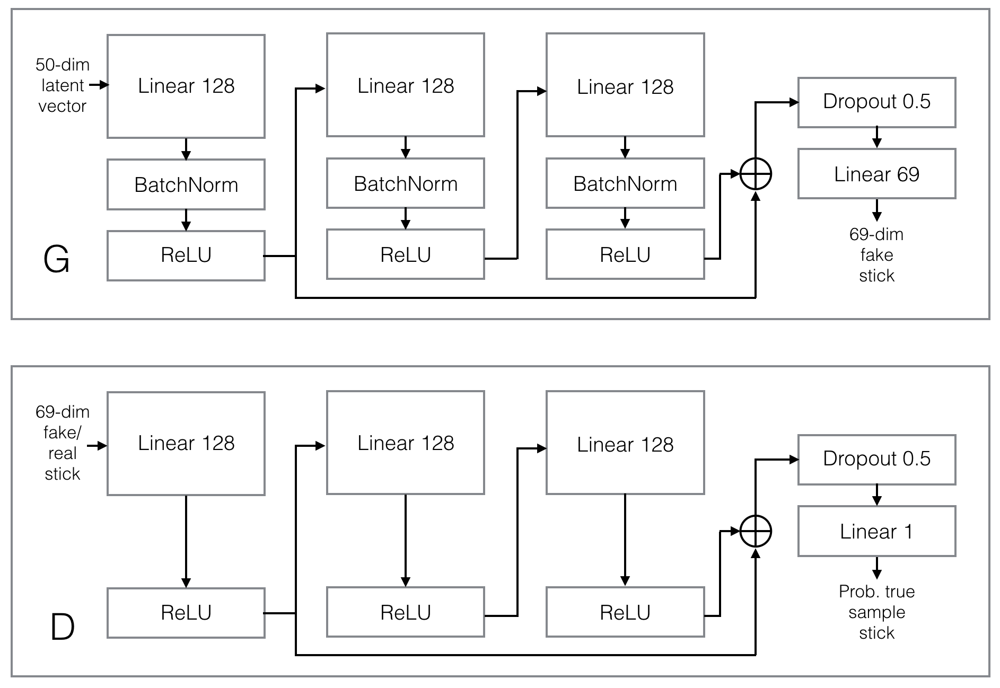

## Implementation of WGANs to generate dance sequences

On top of the frame decoder is added a GRU layer in order to make the generator handle variable-length sequences.

The critic has a totally different architecture : it is a 1-dimensional temporal convolutional network, where the input is a sequence of stick figures whose joint coordinates are passed as channels. The network is made out of several temporal blocks in a similar fashion to fully connected ones mentioned above.

| Trained on all dances | Trained on waltz only | Trained on rumba only |
|:-------------------------:|:-------------------------:|:-------------------------:|
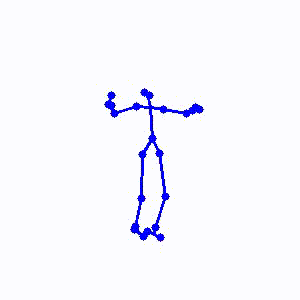 |  | 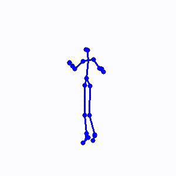 |

## Implementation of WGANs to control dance sequences with audio input

*Coming soon*
